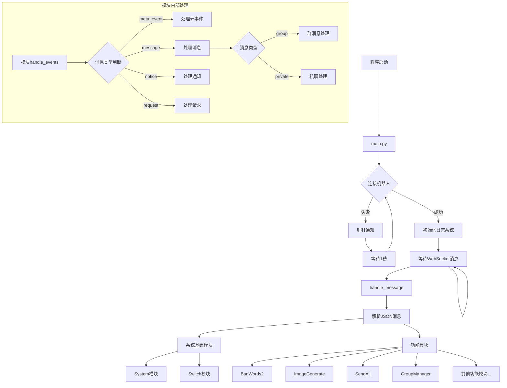

# W1ndys-bot

基于 Python 和 [NapCatQQ](https://napneko.github.io/) 的 QQ 机器人实现。W1ndys 开发的 QQ 机器人，励志成为功能丰富，使用方便的 QQ 机器人。

**🔄 本项目的底层框架正在[W1ndysBotFrame](https://github.com/W1ndysBot/W1ndysBotFrame)重构，目前已完成。**

**本项目正在使用新的底层框架重构，开源在[W1ndysBot-dev](https://github.com/W1ndysBot/W1ndysBot-dev)，重构完成后会合并到本项目。**

## 流程图

## 📚 开发文档

- [NapCatQQ 文档](https://napneko.github.io/)
- [NapCatQQ API](https://napcat.apifox.cn)

## 🔧 技术栈

- **核心开发**: Python
- **消息框架**: [NapCatQQ](https://napneko.github.io/)
- **机器人 API**: [NapCatQQ API](https://napcat.apifox.cn)

## 🌟 星标历史

## 📄 开源协议

本项目采用 [GPL-3.0](./LICENSE) 协议开源。

**重要提示**: 通过本项目所复制或衍生的作品，请遵守开源协议，并注明出处。
